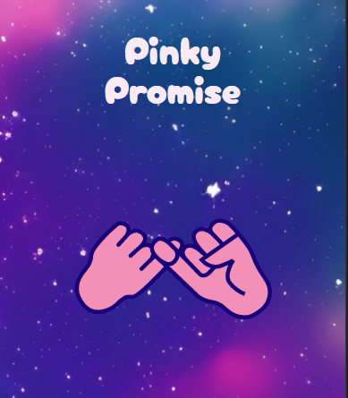
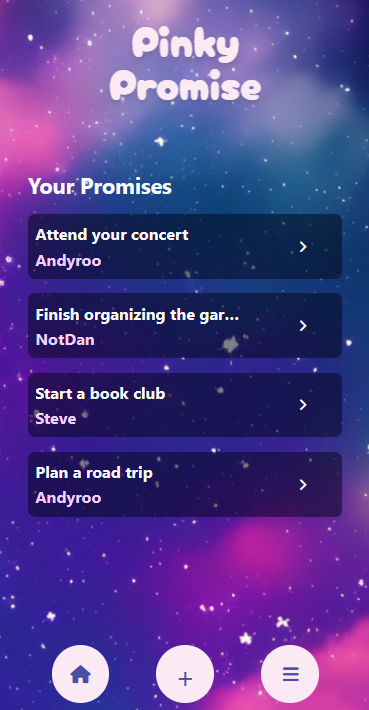
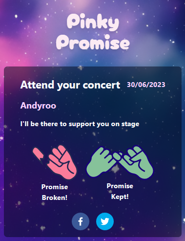

# Pinky Promise





A web app to help keep yourself and friends accountable! A mobile-first app made for the 7-day final group project at Dev Academy.

#### **From the command line**

```
git clone https://github.com/dev-academy-challenges/boilerplate-fullstack [your-project-name]
cd [your-project-name]
npm install # to install dependencies
npm knex migrate:latest # to build database tables
npm knex seed:run # to populate database tables
npm run dev # to start the dev server
```

### Technologies

- React
- Tailwind CSS
- SQLite3
- Knex
- tanstack-query (react-query)
- Framer Motion
- Express
- vite

### Future Development

- Optional Consequences
- Sound Effects
- Notify Users when a promise is broken or kept
- Improve add friends page

### Resources

[Figma Wireframe](https://www.figma.com/file/sNIyAtAcP5v3chOp3jlO7s/Pinky-Promise-Wireframe?type=design&node-id=0%3A1&mode=design&t=PexV5VXsLAXhLeMj-1)
